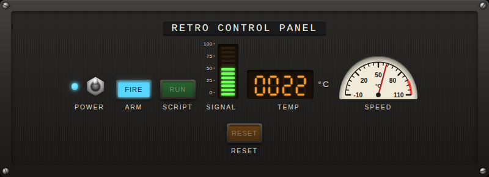
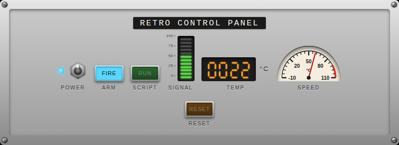
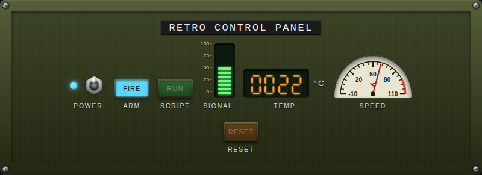
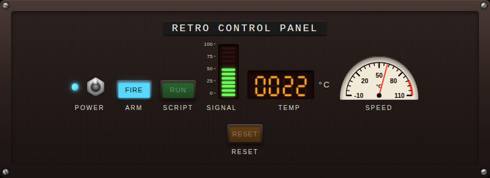

# Retro Control Panel Card

A Home Assistant Lovelace **custom card** that renders any handful of entities
as a chunky, retro-futurist control panel — the kind you'd find in a 1960s
spy-movie villain lair, an old aircraft cockpit or a Cold-War submarine
console.



| Brushed aluminium | Green phosphor | Red alarm |
| :---: | :---: | :---: |
|  |  |  |

Comes with:

- **Seven-segment** numeric displays — leading zeros, fraction digits,
  selectable glow colour, and a unit pulled from the entity (etched/Dymo).
- **VU meter** — segmented LED bar, vertical or horizontal, configurable
  green/yellow/red bands, with an optional engraved scale.
- **Analog gauge** — half-disc dial set into the panel, sweeping needle, tick
  marks and a red danger arc.
- **Flip switches** — top-down chrome bat-handle, with an optional status LED
  indicator. Wired to `input_boolean`, `switch`, `light`, `fan`, …
- **Illuminated push-buttons** — momentary press for `script` / `input_button`
  / `scene`, toggle for everything else, with configurable glow colour (the
  unlit colour stays visible, like real tinted plastic).
- **Etched** *or* **Dymo** label style, picked per-card; the title can override
  it independently.
- Tap / long-press / double-tap actions on every control (long-press defaults
  to *more-info*, so numeric displays show their history graph).
- Four built-in themes: **amber** CRT, **green** phosphor, **red** alarm and
  brushed **aluminium**.

## Installation

### HACS (recommended)

1. In HACS → *Frontend* → ⋮ → **Custom repositories** add this repo's URL
   (category: *Lovelace*).
2. Install **Retro Control Panel Card**.
3. Add the resource to your dashboard if HACS does not do it automatically:
   ```yaml
   url: /hacsfiles/retro-controlpanel-card/retro-controlpanel-card.js
   type: module
   ```

### Manual

1. Download `dist/retro-controlpanel-card.js` from the latest release.
2. Drop it into `<config>/www/`.
3. *Settings → Dashboards → ⋮ → Resources*:
   ```yaml
   url: /local/retro-controlpanel-card.js
   type: module
   ```

## Basic usage

```yaml
type: custom:retro-controlpanel-card
title: Reactor Control
theme: amber              # amber | green | red | aluminium       (default: amber)
label_style: etched       # etched | dymo | none                 (default: etched)
scale: 1.0                # multiplies the panel font-size       (default: 1.0)
rows:
  - entities:
      - entity: sensor.cabin_temperature
        type: seven_segment
        num_digits: 4
        leading_zeros: true
        maximum_fraction_digits: 1
        unit: °C
      - entity: sensor.signal_strength
        type: vu_meter
        min: 0
        max: 100
        segments: 10
        green_threshold: 60      # green band ends at 60% of full-scale
        yellow_threshold: 85     # yellow band ends at 85%; above is red
      - entity: input_boolean.power
        type: flip_switch
  - entities:
      - entity: sensor.speed
        type: gauge
        min: 0
        max: 120
        unit: km/h
        major_ticks: 5
        minor_ticks: 4
      - entity: input_button.fire
        type: button
        color: red
        text: FIRE
      - entity: script.launch_sequence
        type: button
        color: amber
        text: LAUNCH
```

## Configuration reference

### Card

| Key            | Type                            | Default   | Description                                                    |
| -------------- | ------------------------------- | --------- | -------------------------------------------------------------- |
| `type`         | `custom:retro-controlpanel-card`| required  | —                                                              |
| `title`        | `string`                        | —         | Engraved title across the top of the panel.                    |
| `theme`        | `amber` \| `green` \| `red` \| `aluminium` | `amber` | Colour palette for the whole panel.                       |
| `label_style`  | `etched` \| `dymo` \| `none`    | `etched`  | Default label style for every control (overridable per-cell).  |
| `scale`        | `number`                        | `1.0`     | Multiplies every dimension. Use `0.85` to fit more controls.   |
| `rows`         | `Row[]`                         | required  | Each row is a horizontal strip of controls.                    |

### Row

| Key        | Type                                                            | Default  | Description                            |
| ---------- | --------------------------------------------------------------- | -------- | -------------------------------------- |
| `entities` | `Control[]`                                                     | required | Controls laid out left-to-right.       |
| `justify`  | `start` \| `center` \| `end` \| `space-between` \| `space-around`| `center` | CSS `justify-content` for this row.   |

### Common control keys

Every control type accepts the following:

| Key            | Type                          | Description                                                          |
| -------------- | ----------------------------- | -------------------------------------------------------------------- |
| `entity`       | `string`                      | Home Assistant entity id.                                            |
| `type`         | see below                     | Which control to render.                                             |
| `label`        | `string`                      | Override the label (default: `friendly_name` or entity id).          |
| `label_style`  | `etched` \| `dymo` \| `none`  | Per-control label style override.                                    |
| `width`        | CSS length                    | Hard width override for that cell.                                   |
| `height`       | CSS length                    | Hard height override for that cell.                                  |
| `tap_action`   | action object                 | `{action: toggle\|more-info\|none\|call-service, …}` like other HA cards. |

### `type: seven_segment`

| Key                        | Type      | Default | Description                                           |
| -------------------------- | --------- | ------- | ----------------------------------------------------- |
| `num_digits`               | `number`  | `4`     | How many digit slots to render.                       |
| `leading_zeros`            | `boolean` | `false` | Pad with `0`s instead of blanks.                      |
| `maximum_fraction_digits`  | `number`  | `0`     | Round/truncate to this many decimals.                 |
| `minimum_fraction_digits`  | `number`  | `0`     | Always render this many decimals.                     |
| `unit`                     | `string`  | —       | Suffix shown to the right of the digits.              |

Overflow renders as a row of dashes (`----`); `unknown` / `unavailable` also render
as dashes.

### `type: vu_meter`

| Key                 | Type                              | Default | Description                                          |
| ------------------- | --------------------------------- | ------- | ---------------------------------------------------- |
| `min` / `max`       | `number`                          | `0` / `100` | Value range mapped onto the full bar.            |
| `segments`          | `number`                          | `10`    | How many LEDs in the bar.                            |
| `green_threshold`   | `number` (% of full scale)        | `60`    | Bottom band is green up to this percentage.          |
| `yellow_threshold`  | `number` (% of full scale)        | `85`    | Middle band is yellow up to this percentage; above is red. |
| `orientation`       | `vertical` \| `horizontal`        | `vertical` | Bar direction.                                  |

If you accidentally pass `green_threshold > yellow_threshold`, the card sorts
them — the smaller of the two is always the green→yellow boundary.

### `type: gauge`

| Key            | Type     | Default     | Description                                                   |
| -------------- | -------- | ----------- | ------------------------------------------------------------- |
| `min` / `max`  | `number` | `0` / `100` | Value range across the 180° sweep.                            |
| `unit`         | `string` | —           | Etched onto the dial below the pivot.                         |
| `major_ticks`  | `number` | `5`         | Numbered tick marks across the arc.                           |
| `minor_ticks`  | `number` | `4`         | Unnumbered ticks between each pair of majors.                 |

### `type: flip_switch`

No extra keys — uses the standard tap action (toggle by default, override via
`tap_action`).

### `type: button`

| Key      | Type                                              | Default | Description                                                   |
| -------- | ------------------------------------------------- | ------- | ------------------------------------------------------------- |
| `color`  | `amber` \| `green` \| `red` \| `white` \| `blue`  | theme primary | Glow colour of the lit face.                            |
| `text`   | `string`                                          | label   | Text rendered on the button face.                             |

For *stateless* entities (`script`, `input_button`, `button`, `scene`) the
button briefly flashes on press; for stateful entities it stays lit while the
entity is on.

## Layout tips

The panel is intentionally density-aware:

- All sizes are defined in `em` and driven by a single `--retro-scale` variable
  (the `scale:` config key). Bumping `scale: 0.85` shrinks everything in
  proportion — labels stay legible relative to the controls.
- Each control has a sensible minimum size. Rows wrap if they don't fit.
- Use per-cell `width` / `height` overrides when you want a particular control
  to stretch or shrink — e.g. `width: 8em` on a 4-digit display to keep all
  rows aligned.
- Reach for `justify: space-between` to push outermost controls to the panel
  edges; that lets you build column-aligned layouts across many rows.

## Development

With a local Node toolchain:

```bash
npm install
npm run build           # one-shot
npm run watch           # rebuild on change
npm test                # vitest unit tests (happy-dom)
npm run test:ui:install # install Playwright browsers (one-time)
npm run test:ui         # playwright UI tests
```

### Dockerised build & tests (no local Node needed)

The included [Dockerfile](Dockerfile) runs everything in containers; the
PowerShell helper drives it and extracts artifacts to the host:

```powershell
.\docker\build.ps1 -Target build     # -> dist/retro-controlpanel-card.js
.\docker\build.ps1 -Target test      # vitest -> reports/unit/ (HTML + junit + json)
.\docker\build.ps1 -Target test-ui   # playwright -> reports/ui/ (HTML report, junit, traces)
.\docker\build.ps1 -Target shots     # regenerate docs/<theme>.png
.\docker\build.ps1 -Target all       # test, test-ui, build
```

Test reports are extracted **even when tests fail** (the container captures the
real exit code so the report survives). Open these directly in a browser — no
server needed:

- **Unit:** `reports/unit/unit-report.html` (self-contained; also `junit-unit.xml` for CI)
- **UI:** `reports/ui/playwright-html/index.html` (failures, screenshots, traces;
  also `junit-ui.xml`)

Project layout:

```
src/
  retro-controlpanel-card.ts   main card (LitElement)
  types.ts                     all config interfaces
  const.ts                     name + version
  styles/                      panel chrome + theme presets
  controls/                    one file per control type
tests/
  unit/                        vitest specs (happy-dom)
  ui/                          playwright spec + fixture page
```

### Releasing (CI)

[`.github/workflows/release.yml`](.github/workflows/release.yml) runs both test
suites on every push/PR. Pushing a `v*` tag additionally builds the card and
publishes a GitHub release with `retro-controlpanel-card.js` attached — which is
the file HACS downloads. To cut a release:

```bash
# bump "version" in package.json + CARD_VERSION in src/const.ts first
git tag v0.1.0
git push origin v0.1.0
```

Test reporting in CI is all native to GitHub Actions: a pass/fail table renders
in the run's **job summary**, the full HTML reports upload as the
**test-reports** artifact, and `test-reports.zip` is attached to the release.

## License

MIT — see [LICENSE](LICENSE).
