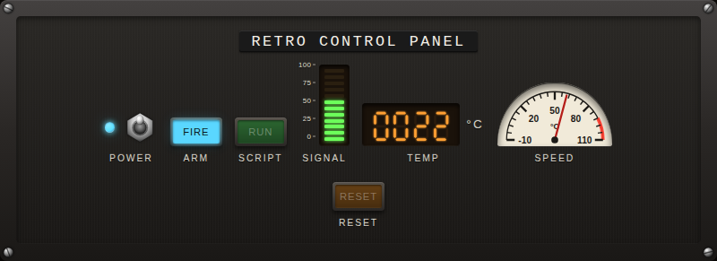
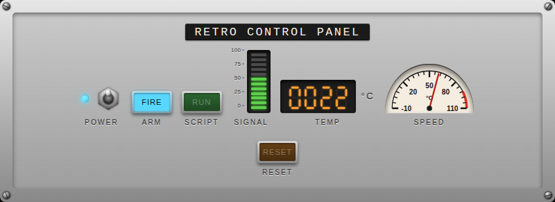
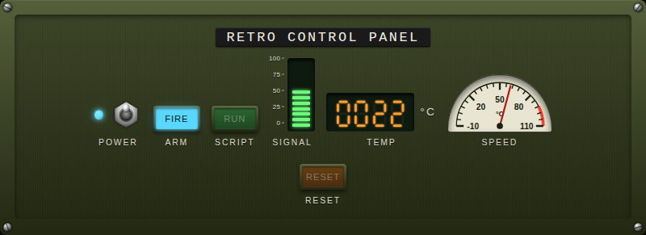
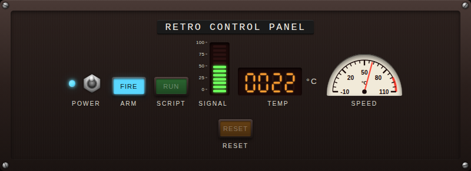

# Retro Control Panel Card

A Home Assistant Lovelace **custom card** that renders any handful of entities
as a chunky, retro-futurist control panel — the kind you'd find in a 1960s
spy-movie villain lair, an old aircraft cockpit or a Cold-War submarine
console.



| Brushed aluminium | Green phosphor | Red alarm |
| :---: | :---: | :---: |
|  |  |  |

Comes with:

- **Seven-segment** numeric displays — leading zeros, fraction digits,
  selectable glow colour, and a unit pulled from the entity (etched/Dymo).
  Can also show a timestamp (`HH:MM`), a countdown / time since, or run as a
  clock, with optional seconds.
- **VU meter** — segmented LED bar, vertical or horizontal, configurable
  green/yellow/red bands, with an optional engraved scale.
- **Analog gauge** — half-disc dial set into the panel, sweeping needle, tick
  marks and a red danger arc.
- **Flip switches** — top-down chrome bat-handle, with an optional status LED
  indicator. Wired to `input_boolean`, `switch`, `light`, `fan`, …
- **Illuminated push-buttons** — momentary press for `script` / `input_button`
  / `scene`, toggle for everything else, with configurable glow colour (the
  unlit colour stays visible, like real tinted plastic).
- **Etched** *or* **Dymo** label style, picked per-card; the title can override
  it independently.
- Tap / long-press / double-tap actions on every control (long-press defaults
  to *more-info*, so numeric displays show their history graph).
- Four built-in themes: **amber** CRT, **green** phosphor, **red** alarm and
  brushed **aluminium**.

## Installation

### HACS (recommended)

1. In HACS → *Frontend* → ⋮ → **Custom repositories** add this repo's URL
   (category: *Lovelace*).
2. Install **Retro Control Panel Card**.
3. Add the resource to your dashboard if HACS does not do it automatically:
   ```yaml
   url: /hacsfiles/retro-controlpanel-card/retro-controlpanel-card.js
   type: module
   ```

### Manual

1. Download `dist/retro-controlpanel-card.js` from the latest release.
2. Drop it into `<config>/www/`.
3. *Settings → Dashboards → ⋮ → Resources*:
   ```yaml
   url: /local/retro-controlpanel-card.js
   type: module
   ```

## Basic usage

```yaml
type: custom:retro-controlpanel-card
title: Reactor Control
theme: amber              # amber | green | red | aluminium       (default: amber)
label_style: etched       # etched | dymo | none                 (default: etched)
scale: 1.0                # multiplies the panel font-size       (default: 1.0)
rows:
  - entities:
      - entity: sensor.cabin_temperature
        type: seven_segment
        num_digits: 4
        leading_zeros: true
        maximum_fraction_digits: 1
        unit: °C
      - entity: sensor.signal_strength
        type: vu_meter
        min: 0
        max: 100
        segments: 10
        green_threshold: 60      # green band ends at 60% of full-scale
        yellow_threshold: 85     # yellow band ends at 85%; above is red
      - entity: input_boolean.power
        type: flip_switch
  - entities:
      - entity: sensor.speed
        type: gauge
        min: 0
        max: 120
        unit: km/h
        major_ticks: 5
        minor_ticks: 4
      - entity: input_button.fire
        type: button
        color: red
        text: FIRE
      - entity: script.launch_sequence
        type: button
        color: amber
        text: LAUNCH
```

## Configuration reference

### Card

| Key            | Type                            | Default   | Description                                                    |
| -------------- | ------------------------------- | --------- | -------------------------------------------------------------- |
| `type`         | `custom:retro-controlpanel-card`| required  | —                                                              |
| `title`        | `string`                        | —         | Engraved title across the top of the panel.                    |
| `theme`        | `amber` \| `green` \| `red` \| `aluminium` | `amber` | Colour palette for the whole panel.                       |
| `label_style`  | `etched` \| `dymo` \| `none`    | `etched`  | Label style for every control. Row and group titles can override it; controls always use this one. |
| `title_style`  | `etched` \| `dymo` \| `none`    | `label_style` | Style of the panel title.                                  |
| `scale`        | `number`                        | `1.0`     | Multiplies every dimension. Use `0.85` to fit more controls.   |
| `rows`         | `Row[]`                         | required  | Each row is a horizontal strip of controls.                    |

### Row

| Key           | Type                                                            | Default  | Description                            |
| ------------- | --------------------------------------------------------------- | -------- | -------------------------------------- |
| `entities`    | `Control[]`                                                     | required | Controls (or groups) laid out left-to-right. |
| `justify`     | `start` \| `center` \| `end` \| `space-between` \| `space-around`| `center` | CSS `justify-content` for this row.   |
| `group_style` | `none` \| `embossed` \| `screwed` \| `stencil`                  | `none`   | Frame around the row's controls: `embossed` = engraved outline, `screwed` = raised plate held by corner screws, `stencil` = painted corner brackets. |
| `label`       | `string`                                                        | —        | Row title above the controls (inside the frame when there is one). A single space hides it. |
| `label_style` | `etched` \| `dymo` \| `none`                                    | panel's `label_style` | Style of the row title.   |

### `type: group`

A group goes in any `entities` list and clusters its own controls into one unit.
That lets one row hold several labelled sub-panels side by side instead of
spending a row on each. Groups can nest.

| Key           | Type                                            | Default  | Description                                      |
| ------------- | ----------------------------------------------- | -------- | ------------------------------------------------ |
| `entities`    | `Control[]`                                     | required | Controls (or further groups) inside the cluster. |
| `group_style` | `none` \| `embossed` \| `screwed` \| `stencil`  | `none`   | Frame around the cluster, as for rows.           |
| `label`       | `string`                                        | —        | Cluster title. A single space hides it.          |
| `label_style` | `etched` \| `dymo` \| `none`                    | panel's `label_style` | Style of the cluster title.         |
| `width` / `height` | CSS length                                 | —        | Size override for the cluster.                   |

Groups have no entity or actions.

```yaml
rows:
  - group_style: screwed
    label: ROOM HUMIDITY
    entities:
      - type: group
        group_style: embossed
        label: BATHROOM
        entities:
          - { type: vu_meter, entity: sensor.bathroom_humidity }
          - { type: vu_meter, entity: sensor.shower_humidity }
      - type: group
        group_style: embossed
        label: KITCHEN
        entities:
          - { type: vu_meter, entity: sensor.kitchen_humidity }
```

### Common control keys

Every control type except `group` accepts the following:

| Key                 | Type                          | Description                                                          |
| ------------------- | ----------------------------- | -------------------------------------------------------------------- |
| `entity`            | `string`                      | Home Assistant entity id.                                            |
| `type`              | see below                     | Which control to render.                                             |
| `label`             | `string`                      | Override the label (default: `friendly_name` or entity id). A single space hides it. |
| `width`             | CSS length                    | Hard width override for that cell.                                   |
| `height`            | CSS length                    | Hard height override for that cell.                                  |
| `tap_action`        | action object                 | `{action: toggle\|more-info\|navigate\|url\|call-service\|none, …}` like other HA cards. Default: toggle for switch-like entities, press/run for buttons, scripts and scenes, more-info otherwise. |
| `hold_action`       | action object                 | Long-press action. Default: `more-info` (details and history).       |
| `double_tap_action` | action object                 | Double-tap action. Default: none.                                    |

### Numeric controls: `attribute` and `indicator`

`seven_segment`, `vu_meter` and `gauge` can read an attribute instead of the state,
which makes complex entities usable. With no `attribute` set and a non-numeric state
they pick one: `weather` → `temperature`, `climate` / `water_heater` →
`current_temperature`, `humidifier` → `current_humidity`, `cover` →
`current_position`, `fan` → `percentage`, `light` → `brightness`, `media_player` →
`volume_level`, `vacuum` → `battery_level`, `sun` → `elevation`. The unit is inferred
for well-known attributes.

`indicator` adds a status LED beside the label in the chosen colour (`amber` \|
`green` \| `red` \| `white` \| `blue`). It lights while the entity is on (or open,
playing, home, …); for `climate`, while it is heating, cooling, drying or running
the fan.

### `type: seven_segment`

| Key                        | Type      | Default | Description                                           |
| -------------------------- | --------- | ------- | ----------------------------------------------------- |
| `display_mode`             | `number` \| `time` \| `countdown` | `number` | What to show — see below.            |
| `show_seconds`             | `boolean` | `false` | `time` / `countdown`: add seconds (`HH:MM:SS`).       |
| `num_digits`               | `number`  | `4`     | How many digit slots to render (`number` mode).       |
| `leading_zeros`            | `boolean` | `false` | Pad with `0`s instead of blanks (`number` mode).      |
| `maximum_fraction_digits`  | `number`  | `0`     | Round/truncate to this many decimals (`number` mode). |
| `minimum_fraction_digits`  | `number`  | `0`     | Always render this many decimals (`number` mode).     |
| `unit`                     | `string`  | entity's unit | Suffix shown to the right of the digits. A single space hides it. |
| `color`                    | `amber` \| `green` \| `red` \| `white` \| `blue` | theme primary | Glow colour of the segments. |
| `attribute`                | `string`  | see above | Read this attribute instead of the state.           |
| `indicator`                | colour    | —       | Status LED beside the label (see above).              |

Overflow renders as a row of dashes (`----`); `unknown` / `unavailable` also render
as dashes.

**Time modes.** The entity's state (or `attribute`) must be a timestamp, such as the
[Islamic Prayer Times](https://www.home-assistant.io/integrations/islamic_prayer_times)
sensors or `sun.sun`'s `next_rising`, or a plain `HH:MM` like `sensor.time`.

- `time` shows it as `HH:MM`. **Leave out the entity and it's a clock** showing the
  current time.
- `countdown` shows the time left until it (`02:14`), then a minus and the time
  since once it has passed (`-05:33`). Spans over 99 hours show dashes.

Times follow your HA profile's time zone setting. Clocks and countdowns tick in the
browser, once a minute or once a second with `show_seconds`, and never poll Home
Assistant.

```yaml
- type: seven_segment
  entity: sensor.dhuhr_prayer
  display_mode: countdown
  show_seconds: true        # 02:14:22 … then -00:05:09 once it has passed
- type: seven_segment
  display_mode: time        # no entity: a clock
```

### `type: vu_meter`

| Key                 | Type                              | Default | Description                                          |
| ------------------- | --------------------------------- | ------- | ---------------------------------------------------- |
| `min` / `max`       | `number`                          | `0` / `100` | Value range mapped onto the full bar.            |
| `segments`          | `number`                          | `10`    | How many LEDs in the bar.                            |
| `green_threshold`   | `number` (% of full scale)        | `60`    | Bottom band is green up to this percentage.          |
| `yellow_threshold`  | `number` (% of full scale)        | `85`    | Middle band is yellow up to this percentage; above is red. |
| `orientation`       | `vertical` \| `horizontal`        | `vertical` | Bar direction.                                  |
| `show_scale`        | `boolean`                         | `false` | Engraved numeric scale beside the bar.               |
| `scale_divisions`   | `number`                          | `4`     | Divisions on the scale (`4` = five numbers).         |
| `show_value`        | `boolean`                         | `false` | Small LCD readout of the value below the bar.        |
| `value_size`        | `number` (em)                     | `1`     | Size of that readout.                                |
| `value_color`       | `amber` \| `green` \| `red` \| `white` \| `blue` | theme primary | Glow colour of that readout.  |
| `attribute`         | `string`                          | see above | Read this attribute instead of the state.          |
| `indicator`         | colour                            | —       | Status LED beside the label (see above).             |

Both thresholds are taken as written, with no sorting. If `yellow_threshold` is
below `green_threshold`, the yellow band disappears: segments are green up to
`green_threshold` and red above it.

### `type: gauge`

| Key            | Type     | Default     | Description                                                   |
| -------------- | -------- | ----------- | ------------------------------------------------------------- |
| `min` / `max`  | `number` | `0` / `100` | Value range across the 180° sweep.                            |
| `unit`         | `string` | entity's unit | Etched onto the dial below the pivot. A single space hides it. |
| `major_ticks`  | `number` | `5`         | Numbered tick marks across the arc.                           |
| `minor_ticks`  | `number` | `4`         | Unnumbered ticks between each pair of majors.                 |
| `show_value`   | `boolean`| `false`     | Small LCD readout of the value below the dial.                |
| `value_size`   | `number` (em) | `1`    | Size of that readout.                                         |
| `value_color`  | `amber` \| `green` \| `red` \| `white` \| `blue` | theme primary | Glow colour of that readout. |
| `attribute`    | `string` | see above   | Read this attribute instead of the state.                     |
| `indicator`    | colour   | —           | Status LED beside the label (see above).                      |

### `type: flip_switch`

Uses the standard tap action (toggle by default, override via `tap_action`).

| Key                  | Type                                              | Default | Description                                  |
| -------------------- | ------------------------------------------------- | ------- | -------------------------------------------- |
| `indicator`          | `amber` \| `green` \| `red` \| `white` \| `blue`  | —       | Status LED next to the switch, lit while on. |
| `indicator_position` | `left` \| `right`                                 | `right` | Which side of the switch the LED sits on.    |

### `type: button`

| Key      | Type                                              | Default | Description                                                   |
| -------- | ------------------------------------------------- | ------- | ------------------------------------------------------------- |
| `color`  | `amber` \| `green` \| `red` \| `white` \| `blue`  | theme primary | Glow colour of the lit face.                            |
| `text`   | `string`                                          | blank   | Text rendered on the button face.                             |

For *stateless* entities (`script`, `input_button`, `button`, `scene`) the
button briefly flashes on press; for stateful entities it stays lit while the
entity is on.

## Layout tips

The panel is intentionally density-aware:

- All sizes are defined in `em` and driven by a single `--retro-scale` variable
  (the `scale:` config key). Bumping `scale: 0.85` shrinks everything in
  proportion — labels stay legible relative to the controls.
- Each control has a sensible minimum size. Rows wrap if they don't fit.
- Use per-cell `width` / `height` overrides when you want a particular control
  to stretch or shrink — e.g. `width: 8em` on a 4-digit display to keep all
  rows aligned.
- Reach for `justify: space-between` to push outermost controls to the panel
  edges; that lets you build column-aligned layouts across many rows.
- To split one row into labelled clusters, wrap them in `type: group` entries
  instead of spending a row on each cluster.

## Development

With a local Node toolchain:

```bash
npm install
npm run build           # one-shot
npm run watch           # rebuild on change
npm test                # vitest unit tests (happy-dom)
npm run test:ui:install # install Playwright browsers (one-time)
npm run test:ui         # playwright UI tests
```

### Dockerised build & tests (no local Node needed)

The included [Dockerfile](Dockerfile) runs everything in containers; the
PowerShell helper drives it and extracts artifacts to the host:

```powershell
.\docker\build.ps1 -Target build     # -> dist/retro-controlpanel-card.js
.\docker\build.ps1 -Target test      # vitest -> reports/unit/ (HTML + junit + json)
.\docker\build.ps1 -Target test-ui   # playwright -> reports/ui/ (HTML report, junit, traces)
.\docker\build.ps1 -Target shots     # regenerate docs/<theme>.png
.\docker\build.ps1 -Target all       # test, test-ui, build
```

Test reports are extracted **even when tests fail** (the container captures the
real exit code so the report survives). Open these directly in a browser — no
server needed:

- **Unit:** `reports/unit/unit-report.html` (self-contained; also `junit-unit.xml` for CI)
- **UI:** `reports/ui/playwright-html/index.html` (failures, screenshots, traces;
  also `junit-ui.xml`)

Project layout:

```
src/
  retro-controlpanel-card.ts   main card (LitElement)
  types.ts                     all config interfaces
  const.ts                     name + version
  styles/                      panel chrome + theme presets
  controls/                    one file per control type
tests/
  unit/                        vitest specs (happy-dom)
  ui/                          playwright spec + fixture page
```

### Releasing (CI)

[`.github/workflows/release.yml`](.github/workflows/release.yml) runs both test
suites on every push/PR. Pushing a `v*` tag additionally builds the card and
publishes a GitHub release with `retro-controlpanel-card.js` attached — which is
the file HACS downloads. To cut a release:

```bash
# bump "version" in package.json + CARD_VERSION in src/const.ts first
git tag v0.1.0
git push origin v0.1.0
```

Test reporting in CI is all native to GitHub Actions: a pass/fail table renders
in the run's **job summary**, the full HTML reports upload as the
**test-reports** artifact, and `test-reports.zip` is attached to the release.

## License

MIT — see [LICENSE](LICENSE).
